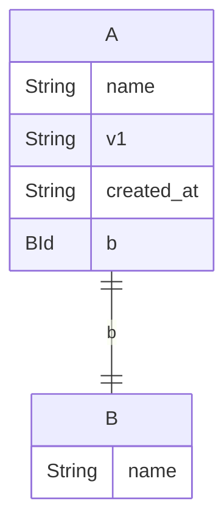

# Structiagram

```mermaid
%%{init: {
            "er": {
                "layoutDirection": "LR",
                "entityPadding": 15,
                "useMaxWidth": false
            }
        }}%%
erDiagram
A {
    String name
    String v1
    String created_at
    BId b
}
B {
    String name
}
A ||--|| B : b
```
